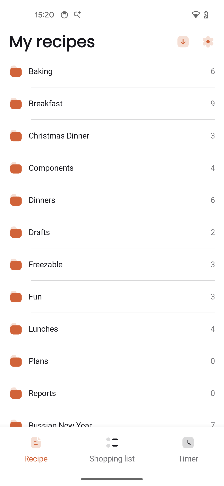
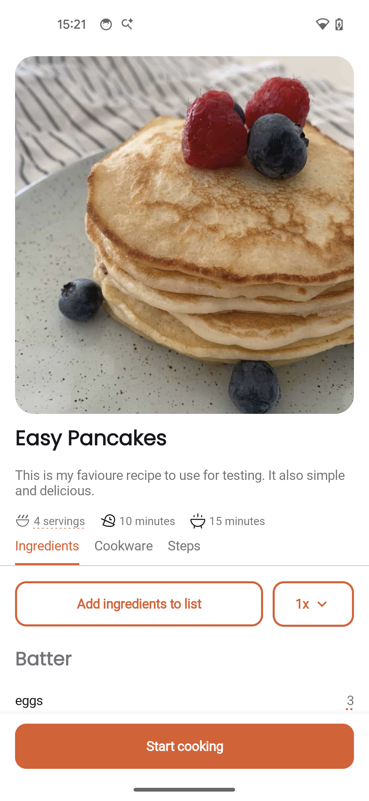
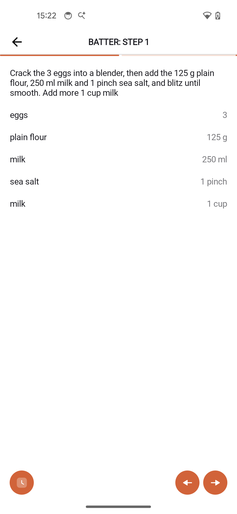
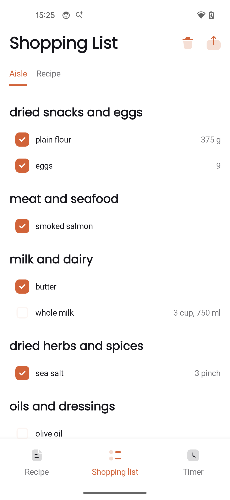

# Cook for Android

Your recipe collection on Android -- browse, cook, and shop with [Cooklang](https://cooklang.org) recipes.

<a href="https://play.google.com/store/apps/details?id=md.cook.android">
  
</a>

<p>
  
  
  
  
</p>

## Features

- **Recipe browsing** -- organize recipes in folders, view with images and metadata
- **Cooking mode** -- step-by-step guidance with ingredient highlights and mise en place checklist
- **Recipe scaling** -- adjust servings with automatic quantity recalculation
- **Shopping lists** -- auto-generated from recipes, organized by aisle, shareable
- **Timers** -- built-in with background notifications
- **Clip recipes** -- import from any URL or photo into Cooklang format
- **Sync** -- via [CookCloud](https://cook.md) across all devices, or use local folders
- **Offline** -- works without internet once synced

## Getting started

1. Install from [Google Play](https://play.google.com/store/apps/details?id=md.cook.android)
2. Choose a sync method -- CookCloud (recommended) or local folder
3. Add recipes using the [Sync Agent](https://github.com/cook-md/sync-agent) or any text editor

Recipes are plain text `.cook` files written in [Cooklang](https://cooklang.org). Example:

```
---
servings: 2
time: 25 minutes
---

Heat @olive oil{2%tbsp} in a #pan{}.
Add @garlic{3%cloves}, minced, and cook for ~{1%minute}.
Toss in @cherry tomatoes{200%g} and @basil{a handful}.
Season with @salt{} and @pepper{} to taste.
```

## Help & documentation

Full documentation with screenshots and guides is available at **[cook.md/help/android](https://cook.md/help/android)**.

## Issues & feedback

This repository is for collecting **[bug reports](https://github.com/cook-md/android-app/issues)** and **[feature discussions](https://github.com/cook-md/android-app/discussions)**.

When reporting a bug, please include:
- Device model and Android version
- App version (Settings > About)
- Steps to reproduce

## Related projects

| Project | Description |
|---------|-------------|
| [Cooklang](https://cooklang.org) | Recipe markup language |
| [Cook for iOS](https://github.com/cook-md/ios-app) | iOS app |
| [Sync Agent](https://github.com/cook-md/sync-agent) | Desktop sync agent |
| [CookCloud](https://cook.md) | Cloud sync service |